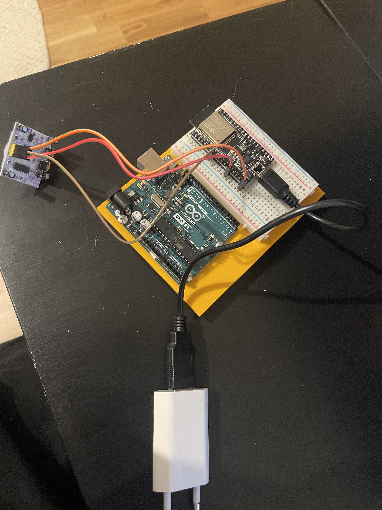
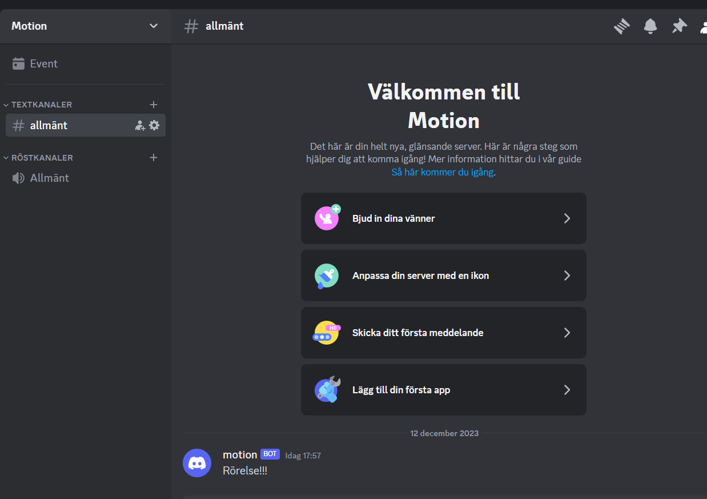

# Detect-Motion
Project with a sensor connected to an ESP32 which detects motion and sends a notification from Adafruit down to a Discord server.

***Picutre displaying the hardware.***

***Picutre displaying notification to Discord.***

